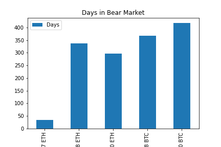
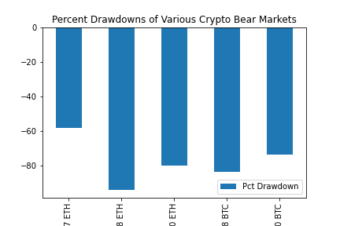
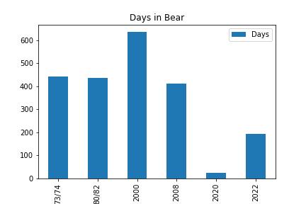
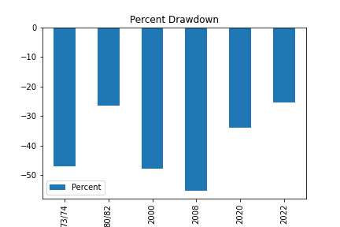
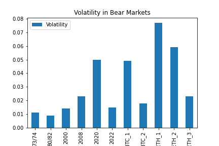
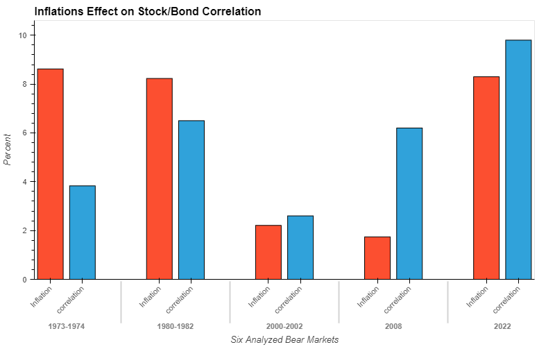
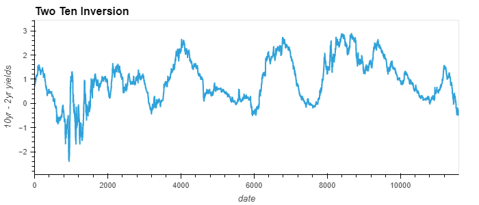
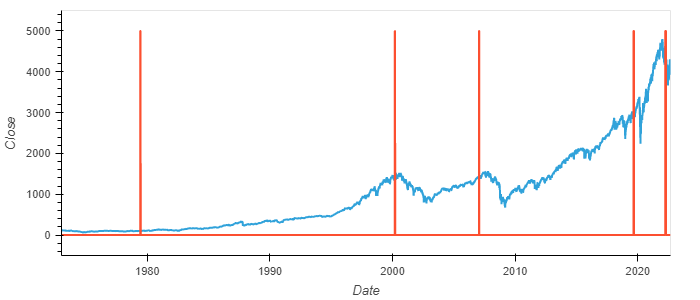
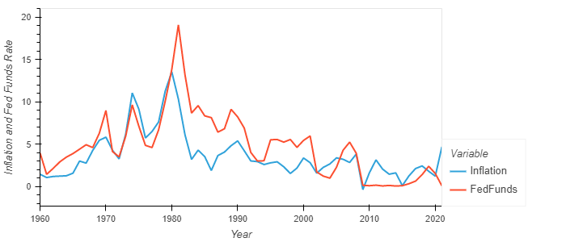

# **Project-1: Analyzing Bear Markets in Traditional Markets and Crypto**

---
## Motivation and Summary:
The purpose of this project is to get a better understanding of how bear markets work. We wanted to understand a few things: First we wanted to see how long previous bear markets have lasted in both traditional and crypto markets, as well as how large the typical drawdown is that can be expected. Next, we also wanted to answer how volatile these markets can be and specifically how inflation can effect the typical negative correlation seen between stock and bond prices when recessions occur. Finally, we also wanted to see how yields can effect and predict the oncoming of recessions/bear markets and take a look at the effect of inflation and the federal funds rate as the federal reserve has attempted to tame infaltion in the past. We asked these questions to get a general sense of where we may now be in the market and what we could potentially expect to see in the future.

---
## Questions and Data:
To answer these questions, we needed a large quantity of data. In order to determine the length and drawdowns of these bear markets we needed a total history of closing data across traditional and crypto markets. We got this data from two sources. We got the data from the SP500 from the Federal Reserve Bank of St.Louis and we got the market data for crypto by using the Alpacas API. Using this data we were able to calculate the drawdowns, volatility, and duration of bear markets starting from ~1970 all the way to now. 
>
Furthermore, we gathered data on the two-year gov't bond yields and ten-year gov't bond yields, as well as historical inflation data and federal funds rates from the Federal Reserve Bank of St.Louis. Using this data we were able to analyze yield curve inversions, the stock/bond volatility, and also how fed funds rates effect inflation.
>
Ultimately, from traditional markets, we analyzed six of the most prominent bear markets that have occured in history. This consisted of the bear markets of 1973-1974, where inflation begun to initially arise in the U.S. and the bear of 1980-1982, where Paul Volker began to raise interest rates to extreme levels in order to tame inflation. The other bears included the dotcom bubble burst of 2000, the great financial crisis of 2008, the 2020 covid bear market, and the current bear market we're in currently.

---
## How long do bear markets last and what are the % drawdowns of these markets in both traditional markets and crypto markets respectively?
Beginning with Crypto markets, we can take a look at the below graphs to get an idea of what these bear markets look like for both BTC and ETH. 
>

>

>
Looking at the % drawdown, we can see from the highest value of the bull market to the lowest value during the bear market, the total drawdown for BTC comes in between roughly 70-80%. The average drawdown in these periods was 78.53%. For context, the current bear market for BTC has been going for roughly 361 days and has seen a ~72% decline from high to low --> very close to what the prior averages have looked like!
>
In 2017 there was a very short lived bear market of just 35 days that definitely seems to be an outlier from the norm. Despite the brevity of this bear market, you'll see below that the drawdown was still significant. The other two bear markets lasted between roughly 200-300 days and averaged 198 days.The drawdowns from top to bottom in ETH are very similar to BTC, to no surpise. These drawdowns spanned between 55-88% with an average drawdown of 77.39%.
>
Finally, lets take a look at the drawdowns that occured from traditional markets. 
>

>
It seems that the typical bear market from the data we gathered ranges somewhere between 200-400 days. Covid was an obvious outlier that didn't last long due to the federal reserve pumping the economy and setting interest rates near 0. The average days in bear market was 347. 
>

>
The percent drawdown of these markets ranged anywhere between 25%-55% depending on the severity. 2008 was the largest drawdown which makes sense due to how severe it was across the globe. The average drawdown was 39.3%.

---
## How volatile are traditional and crypto markets during these bear markets?
>
To get an idea of how volatile each of these drawdowns were relative to one another, we used the seperated dataframes that were filtered to each bear market in both traditional markets and crypto markets. We then took those dataframes and calculated the percent change, and then the standard deviation of the returns. Below was the result:
>

>
It can be seen, that outside of the extreme rare case of the 2020 covid crash, that all of the crypto markets obviously have much larger volatility. Aside from that, ETH is more volatile than BTC, which would make sense considering BTC is likely where investors flee to in crashes due to it being the longest standing and most widely known cryptocurrency. 

---
## How does inflation effect stock/bond correlation?
>
This graph illustrates what we had originally thought when going into the data analysis. It can be seen that in times of high inflationary periods, that the typical negative correlation seen between stocks and bonds no longer tends to hold. The red bar graphs illustrate the inflation rate at the time of the bear market and the blue bar represents the correlation between stocks and bonds. The first two bear markets from left to right represent the years of 73-74 and 80-82, respectively. These time periods had bouts of high inflation and due to this, investors did not flee to bonds as a safe invetment due to the interest rate risk associated with the federal reserve increasing interest rates. The recession with the largest blue bar shows the most extreme value for the stock bond correlation, in which returns are very negatively correlated. This is due to inflation being very low, and investors fleeing to bonds as a safe haven given the covid crisis. This reinforces our idea that in times of high inflation, typical stock/bond correlation does not hold, as investors largely sell off both equities and bonds, where as in bear markets with low inflation, the correlation does hold.  
>

---
## How can bond yields be used to help predict bear markets?
>
Since we used the 10yr yield and 2yr yield data to help us calculate the correlation between stocks and bonds during bear markets, we decided to also anaylze what happens to yields around these times. We decided to analyze the typical 10-2 yield inversion that is famous for being able to predict recessions with an incredible hit rate. To do this we created a dataframe for the 10yr yields and the 2yr yields and then subtracted the 2yr from the 10yr. Typically, 10yr yields should always have a higher yield than 2yr yields due to the greater amount of time your money will be locked up and the increased risk that accompanies that. However, this phenomneon in which the 2yr yield surpasses the 10yr yield can be seen in the following graph:
>

>
In this graph, any value below 0 indicates a time period in which 2yr yields surpassed 10yr yields. The 2yr yield increasing relative to 10yr is an indication that short term economic prospects are poor, so people are selling out of 2yr bonds and buying into longer duration (10yr bonds) and thus the yield increases to accompany the perceieved increased risk for that time period.
>
So, what would it look like if we could see where the yield curve inverted relative to when these six bear markets occured that we analyzed in traditonal markets? Take a look below:
>

>
Disclaimer: The historical data for the 2yr yield didn't go back far enough to calculate this for the 1970-1972 bear market, so were showing 5 indicators instead of 6. Furthermore, appreciation in the SNP500 renders the first indicator almost unreadable because the value is so small in relation, but if you were able to zoom into the image you could see the first indicator does in fact work.
>
Ok... Incredibly interesting. The red line going through this graph is an indication of when the 10yr-2yr curve inverted, and you can see that after every single one... There is our bear market. With this information we can conclude that analyzing and paying attention to government bond yields, and more importantly yield curve inversions can be incredibly helpful as an indicator for future turbulence in the markets. 

---
## How high must interest rates go to tame inflation?
>
To answer this question, we created a dataframe that includes the yearly CPI readings from the U.S. and a seperate dateframe that includes the federal funds rate from the past all the way to now. We then took these two dataframes and graphed them and overlayed them onto eachother to help give us an idea of what inflation has looked like in the past and how the federal reserve has reacted to abate inflationary pressures. Let's take a look below:
>

>
This chart provides some intersting context: You can see that in periods of high inflation, inflation has never came down with out the federal funds rate *exceeding* the inflation rate. A really beautiful example of this is encapsulated in the 73-74 bear market and 80-82 bear market. Take a look at that 73-74 range. The fed funds rate is increasing and just about to surpass inflation, and then the fed funds rate is cut! inflation begins to abate, and then with lag sky rockets after the fed funds rate is cut. This was an attempt at the federal reserve to ease interest rates in the interest of the stock market. Ultimately, we can see that pulling back on increasing rates is NOT an option if you want to slay inflation. This hesitancy by the federal reserve is ultimately what led to Paul Volker having to raise interest rates to their highest level in history in the 80-82 period and led to that bear market. Perhaps if the pain of rising rates was absorbed in the years of 73-74, inflation would've been tackled sooner, and the bear market of 80-82 may have never happened. Interesting history. 
>
These charts helped us answer the question of how high rates must go to tame inflation, it seems based on history, that in order to bring inflation down, federal funds rates must exceed the level of inflation. 

---
## Conclusion:
To conclude, it appears that the bear markets in both traditional and crypto markets last generally around the same amount of time. The drawdowns in crypto markets are much more viscious and the volatility included in them is also much higher.
>
Furthermore, stock/bond correlations do seem to increase in times of inflationary pressures due to continued selling of bonds from those expecting future yields to increase. This makes it much more difficult to diversify into the classic 60/40 portfolio that many hold, because there is no safehaven from these drawdowns.
> 
We also found that yield curve inversions are very effective tools to allow you to get a sense of when a recession may be coming and that in this current inflationary climate, it is likely that inflation will not abate until the federal funds rate is higher than core cpi. Currently, fed funds is 3.7% to 4% and core cpi is around 6.4%. 
>
The current bear market were in at the time of writing this has been shorter in duration than most seen from history, and has also had a lower drawdown from those we've studied. Although impossible to make conclusions based off of historical data like this, with the expectation of yields continuing to rise, we believe that although we may be through the brunt of the market downturn, there is good reason to believe that the selling may continue to go further, and that the bottom is not yet in.

